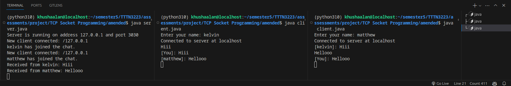

# Terminal Chat

```bash
java server.java
```

Open a new terminal and run the client:

```bash
java client.java
```



You can run multiple clients at the same time.

# GUI Chat

Still in development

1. left pane should list the group chats. Preferably just use one group. If want more groups then need to run thread in the server file.
2. right pane displays all the past chat histories of the selected group.


